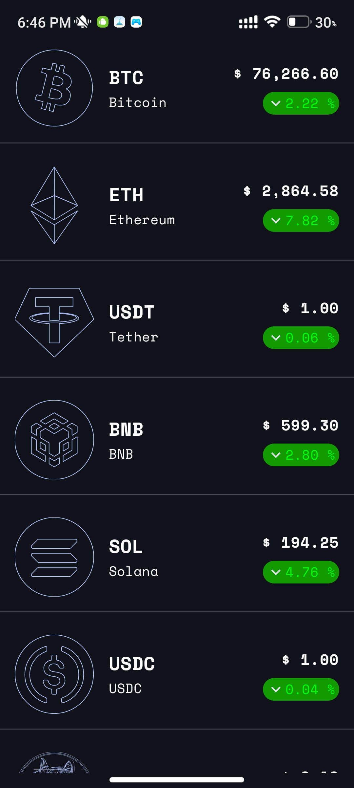
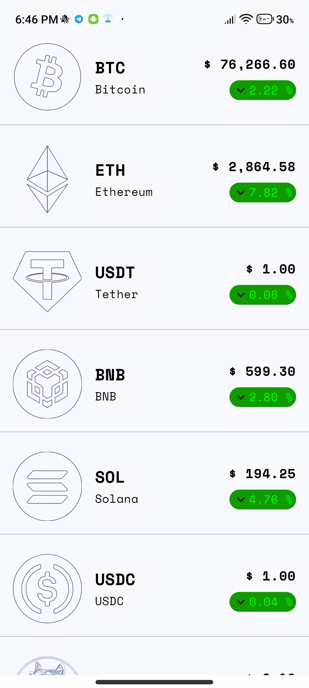
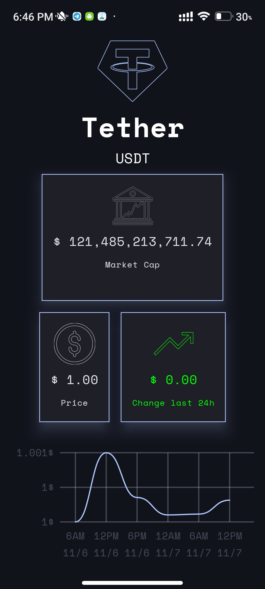
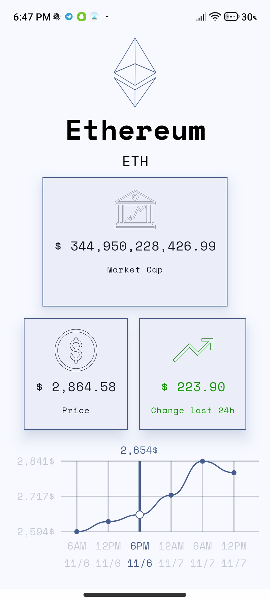

# Coin Tracker App

Coin Tracker is a simple cryptocurrency tracking app that displays a list of coins with detailed information about each coin. The app is built using modern Android tools, including Jetpack Compose, Ktor client for network requests, and Kotlin Coroutines with Flow and Channels for reactive programming. It also follows Material 3 design principles for a polished user interface.

## Features

Coin List Screen: Displays a list of available coins with current prices and market data.
Detail Screen: Provides more information about a selected coin, such as price changes, market trends, and other statistics.
Real-time Data Updates: Uses Coroutines and Flow to fetch and update data in real time.
Material 3 Design: Styled with Material 3 components for a modern, cohesive look and feel.
Backend Communication: Uses Ktor client to connect to a cryptocurrency API for live data.
## Technologies Used

Jetpack Compose: Declarative UI with Material 3 components.
Ktor Client: For making HTTP requests to fetch cryptocurrency data.
Kotlin Coroutines and Flow: Handles asynchronous programming and real-time updates.
Channels: Manages one-time events and communication between coroutines.
## Screenshots
&nbsp;&nbsp;&nbsp;&nbsp;  
&nbsp;&nbsp;&nbsp;&nbsp;

